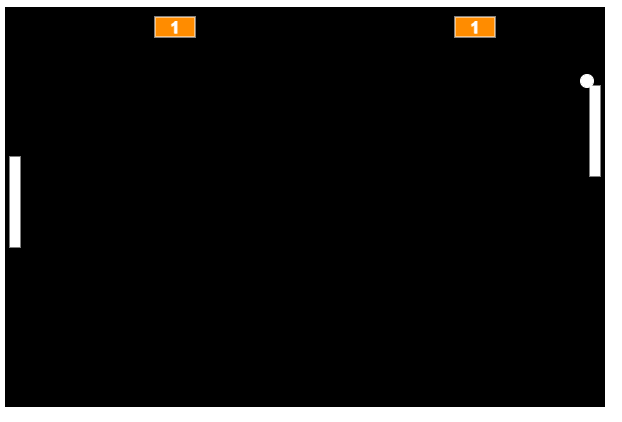

<h1 align="center">Ping Pong Game</h1>

  

## Descrição

Este é um projeto de jogo Ping Pong desenvolvido em JavaScript utilizando a biblioteca p5.js. O jogo consiste em uma versão digital do clássico jogo de ping pong, onde dois jogadores controlam raquetes para rebater uma bola. O objetivo é evitar que a bola ultrapasse a raquete e marcar pontos rebatendo-a para o lado oposto.

## Funcionalidades

- Controles de raquete: Os jogadores podem mover suas raquetes para cima e para baixo usando as teclas de seta.
- Detecção de colisão: O jogo detecta colisões entre a bola e as raquetes, revertendo a direção da bola quando ocorre uma colisão.
- Sistema de pontuação: O jogo mantém a pontuação de ambos os jogadores e atualiza-a conforme a bola ultrapassa a raquete.
- Reinício do jogo: Quando um jogador alcança uma pontuação máxima definida, o jogo reinicia e a pontuação é zerada.

## Screenshots

Adicione algumas screenshots do jogo aqui.

## Como Executar

1. Clone o repositório para o seu ambiente local.
2. Abra o arquivo `index.html` em um navegador da web compatível.
3. Jogue o jogo usando as teclas de seta para mover as raquetes para cima e para baixo.

## Recursos Utilizados

- [p5.js](https://p5js.org/): Biblioteca JavaScript para criação de gráficos interativos.
- [p5.collide2d](https://github.com/bmoren/p5.collide2D): Biblioteca para detecção de colisão em p5.js.

## Contribuição

Contribuições são bem-vindas! Sinta-se à vontade para abrir problemas (issues) e enviar pull requests para melhorias do jogo.

## Licença

Este projeto é licenciado sob a [MIT License](LICENSE).
